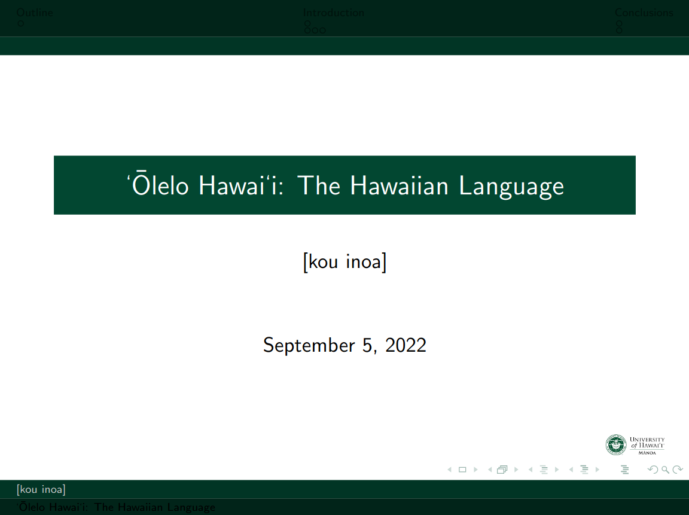
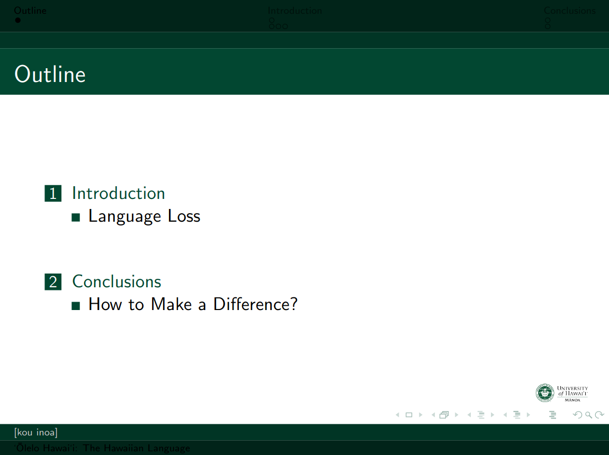

# UHM - Beamer Presentation Template
=============================================================

LaTeX Beamer presentation template made for use with Overleaf.

## Preview:
--------
### Title Slide

### Outline

## Benefits:
--------
1. Includes compatibility with Okina.
2. Includes school colors and logo.

## Installation:
--------
1. Installation is simply downloading the code from github as a Zip file.
2. Click on 'New Project' from your project home.
3. Select Upload Project.
4. Select the downloaded Zip file.

## Generating the Presentation:
----------------------------
1. Overleaf allows automatic generation upon saving each file or in continuous format.
   1. See Overleaf documentation for additional help.